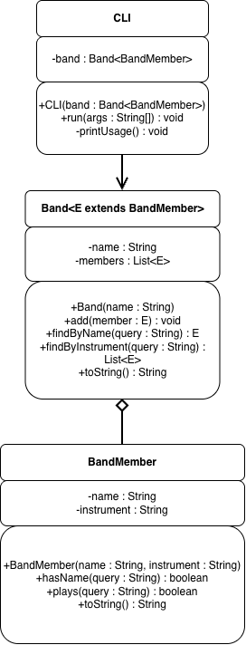

# Band Directory

A command-line tool for looking up the members of a band by name or by instrument. It runs entirely from command-line arguments, with no prompts.

```
java Driver -p              # print the whole band
java Driver -n "Matt Ochoa" # find a member by name
java Driver -i vocals       # find everyone who plays an instrument
```

Anything else (no arguments, an unknown option, a missing or extra value) prints a usage message.

---

## Overview

This project was about design more than code. I wrote the design first ([DESIGN.md](DESIGN.md)), with a class diagram and test cases, got feedback on it, and then built it.



The main idea is that each class has one job:

- **BandMember** is one person: a name and an instrument.
- **Band** holds the members and does the searching.
- **CLI** reads the arguments and does all of the printing.
- **Driver** builds the band and hands it to the CLI.

---

## Design choices

- **No getters or setters.** Instead of asking a member for its name and comparing it somewhere else, the member answers the question itself (`hasName`, `plays`). The code reads closer to plain English that way.
- **Generics.** `Band<E extends BandMember>` can hold `BandMember` or any subclass of it, like a lead singer with extra info, without changing any of the search code.
- **Iterators** walk the member list for every search and for printing.
- **Case-insensitive matching**, so `-n "matt ochoa"` still finds Matt Ochoa.

---

## What I learned

At first I wanted to put the searching in the CLI, but it made more sense for `Band` to search its own members and for the CLI to just print the results. Making `Band` generic was the part I had to think about most, mainly where the `E` goes and what type the CLI should use. The design feedback also pushed me to program to the `List` interface instead of `ArrayList`, and to be a lot more careful with what the arrows in a UML diagram actually mean.

---

## Running it

```
javac *.java
java Driver -p
```
