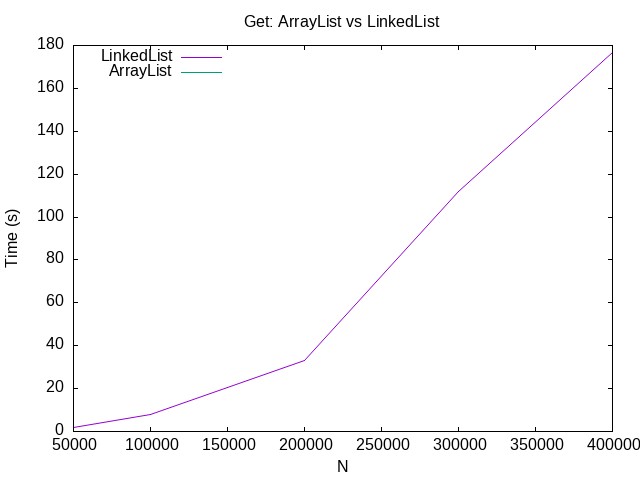

# List Performance Study

ArrayList and LinkedList have the same methods, so which one should you use? Instead of guessing, this project measures them. It times both lists as the data grows, plots the results, and checks them against Big-O predictions.

Built with a classmate.

---

## Overview

We tested the two operations where the lists should behave the most differently:

- **Inserting at the front** (`add(0, x)`): an ArrayList has to shift every element over one spot, while a LinkedList just adds a new head node.
- **Reading by index** (`get(i)`): an ArrayList jumps straight to the index, while a LinkedList has to walk node by node.

For each one we wrote down a prediction first, then ran it at five sizes and graphed the times with gnuplot.

---

## Results

### Inserting N items at the front


| N | ArrayList | LinkedList |
|---|---|---|
| 12,000 | 1.87 s | 0.017 s |
| 24,000 | 8.36 s | 0.024 s |
| 48,000 | 34.33 s | 0.107 s |
| 72,000 | 81.58 s | 0.169 s |
| 96,000 | 149.79 s | 0.234 s |

### Reading all N items by index



| N | LinkedList | ArrayList |
|---|---|---|
| 50,000 | 2.05 s | 0.004 s |
| 100,000 | 8.16 s | 0.003 s |
| 200,000 | 33.33 s | 0.006 s |
| 300,000 | 111.76 s | 0.010 s |
| 400,000 | 176.97 s | 0.009 s |

---

## What the numbers show

- **Both predictions held up.** Each time N doubled, the slow list took about 4× longer, which is the signature of O(N²) overall (O(N) per operation). At 8× the data, both were roughly 80× slower, close to the 64× that 8² predicts.
- **The fast list stayed nearly flat.** LinkedList inserts at the front and ArrayList reads stayed under a quarter of a second the whole way.
- **Inserting at the end is a tie.** We also switched to `add(x)`, and both lists finished in a few milliseconds and grew linearly.
- **The takeaway:** with the wrong data structure, the same job took 150 seconds instead of a quarter of a second.

---

## Running it

```
javac *.java
java TimeTrialInsert 12000
java TimeTrialGet 50000
```

Switch between ArrayList and LinkedList by swapping the commented line at the top of each `main`. Raw timings are in `inserttimes.dat` and `gettimes.dat`.
