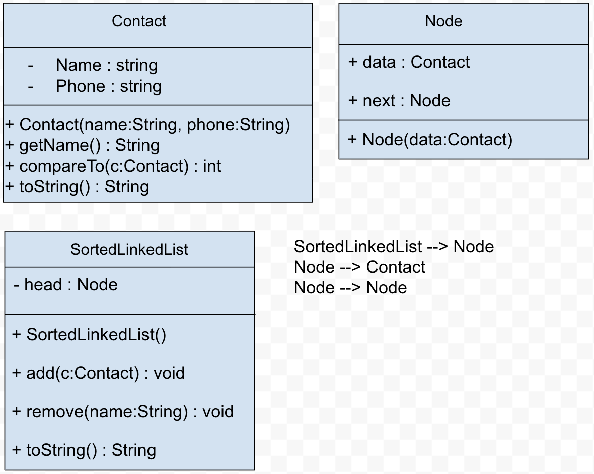

# Sorted Contact Book

A command-line phonebook built on a linked list I wrote from scratch. Every contact is placed in alphabetical order as it's added, so the list never needs to be sorted.

Built with a classmate.

---

## Overview

```
1. Add Contact
2. Remove Contact
3. Print Contacts
0. Quit
```



- **Contact** holds a name and phone number and implements `Comparable`, so contacts know how to order themselves.
- **Node** holds one contact and a link to the next node.
- **SortedLinkedList** manages the chain of nodes.

---

## How It Works

**Adding** walks the list until it finds the first contact that should come after the new one, then splices the new node in. This takes three cases:

1. The list is empty, so the new node becomes the head.
2. The new contact comes before the head, so it becomes the new head.
3. Otherwise it walks forward and inserts in the middle or at the end.

**Removing** handles the same idea in reverse: an empty list, removing the head, or unlinking a node from the middle or end by pointing the previous node past it.

I wrote out the algorithm in plain steps before coding it, which made the edge cases (empty list, new head) much easier to get right.

---

## Running it

```
javac *.java
java Main
```
