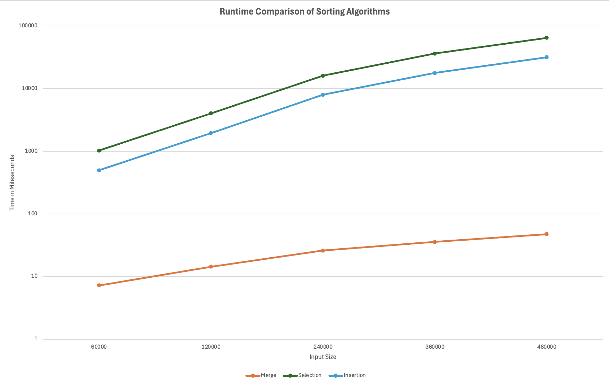

# Sorting Benchmark

An experiment that races selection sort, insertion sort and merge sort against each other on the same random data and measures how their run times grow as the input gets bigger.

Built with a classmate. Merge sort was provided as a reference implementation; we wrote selection sort, insertion sort and the timing code.

---

## Overview

The program takes a size `n`, fills an array with `n` random integers, and gives each algorithm its own copy of the same array so the comparison is fair. Each sort is timed with `System.nanoTime()`.

We picked a starting size (N = 60,000) that took selection sort about one second, then ran N, 2N, 4N, 6N and 8N.

---

## Results



| Input size | Merge | Insertion | Selection |
|---|---|---|---|
| 60,000 | 7 ms | 0.5 s | 1.0 s |
| 120,000 | 14 ms | 2.0 s | 4.0 s |
| 240,000 | 26 ms | 8.0 s | 16.1 s |
| 360,000 | 36 ms | 17.8 s | 36.4 s |
| 480,000 | 48 ms | 31.8 s | 64.9 s |

Raw timings are in [results.txt](results.txt).

---

## What the numbers show

- **Selection and insertion sort are O(n²).** Doubling the input made them about 4× slower, and 8× the input made them about 64× slower, which is exactly 8².
- **Merge sort is O(n log n).** 8× the input took only about 6.6× longer.
- At 480,000 numbers, merge sort finished in under a twentieth of a second, while selection sort took over a minute.
- Insertion sort consistently ran about twice as fast as selection sort on random data, even though both are O(n²), because it does less work per pass.

---

## Running it

```
javac *.java
java Main 60000
```
