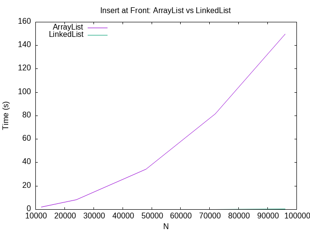

# Inserting into ArrayList vs LinkedList

## Inserting at the beginning

Speculation:

ArrayList: We think add(0, x) is O(N) for an ArrayList. Since it uses an array, every element has to shift over one spot to make room at index 0. So doing N inserts should be O(N^2) overall.

LinkedList: We think add(0, x) is O(1) for a LinkedList. It just makes a new node and points it at the old head, so nothing has to move. Doing N inserts should be O(N) overall.

How the graph supports this:

The ArrayList line curves up like a parabola. Every time we doubled N, the time went up about 4 times (1.87 s -> 8.36 s -> 34.33 s). At 8N it took about 80 times longer than at N, which is pretty close to 8^2 = 64. This is what we would expect from O(N^2).

The LinkedList line is basically flat at the bottom of the graph. Its times only went from 0.017 s to 0.234 s, which grows about the same rate as N, so it looks like O(1) per insert.

## Inserting at the end

Speculation: We think both lists will be about O(1) per insert when adding to the end, so N inserts would be O(N) overall.

ArrayList: The new element just goes in the next open spot so nothing has to shift. Sometimes the array fills up and has to be copied into a bigger one, but on average each insert should still be O(1).

LinkedList: It keeps track of its last node, so adding a new node at the end is O(1).

Results: We changed TimeTrialInsert.java to use l.add(Integer.valueOf(i)) instead (we left this line commented out in the file) and ran it with the same values of N:

| N     | ArrayList (s) | LinkedList (s) |
|-------|---------------|----------------|
| 12000 | 0.00059       | 0.00065        |
| 24000 | 0.00101       | 0.00098        |
| 48000 | 0.00161       | 0.00163        |
| 72000 | 0.00229       | 0.00229        |
| 96000 | 0.00244       | 0.00261        |

The results match what we thought. Both lists only took a few milliseconds, they were almost the same, and the time went up about linearly with N. For the ArrayList this was way faster than inserting at the front.
