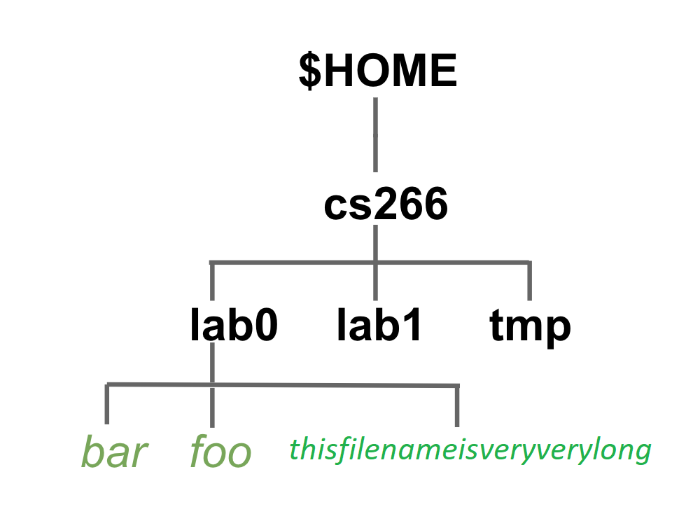

# CS 266 - Week 2 Lab 

## Summary
This lab will introduce/re-introduce you to the Linux environment (shell/terminal) and filesystem navigation and manipulation.
We will connect to a Linux server to use some basic commands and practice a text editor of your choice.  

## Task 1 (10 points)
Using the **script** command to record your session and store it in a file named **task1.txt**.  
If you are not sure how to use **script**, look [here](SCRIPT.md) 
Use **pwd**, **who** and **echo** to show what directory you log into, who else is logged into the machine you are logged into, and print a message of your choice. 

## Task 2 (20 points)
Using the **script** command to record your session and store it in a file named **task2.txt**.  As a reminder, when you connect to a Linux server, your terminal will always start from your $HOME directory. 

1. Start from your **\$HOME** directory, create the following directory hierarchy:

**cs266, lab0, lab1, tmp** are directories and bar, foo and foobar are files. 
You can use command `touch` to quickly create an empty file. For example, to create an empty file named bar use:
`touch bar`. 

2. In the **cs266** directory create a directory named **backup**.
3. Copy **foo** to **backup**.
4. Remove **backup**.
5. Move file **thisfilenameisveryverylong** to the **tmp** directory.

Afterwards, you should go back to your $HOME directory. 
To check if you have the correct directories and files, run **ls -R cs266**.

## Task 3 (25 points)
You will start with the **script** command to record your work for this task in a file named **task3.txt**

There is a text file in your repository named **lyric.txt**
 

1. Show the content of the text file.
2. Show the number of words in the text file.
3. Show the first 3 lines of the text file.
4. Show the last 3 lines of the text file. 
Commands you may want to use: **cat**, **wc**, **head**, **tail**.

## Task 4 (20 points)
0. Use `script` to create **task4.txt**. 
1. Create three files: hidden.txt, everyone.txt, and extra.txt.
2. Display the permissions of all the files in your current directory. 
3. Using symbolic notation, add the write permission for "other" to everyone.txt and extra.txt. (Bonus points if you can do it using wildcards).
4. Display the permissions of all the files in your current directory.
5. Using numeric notation, make hidden.txt readable and writable by only you and executable by nobody.
6. Display the permissions of all the files in your current directory.
7. In your directory, there is a file called "runme.sh". Try to run it using the command `./runme.sh`. (It will fail.)
8. Diagnose and fix the problem and get it to run.

## Submission
Commit the text files (**task1.txt, task2.txt, task3.txt, task4.txt) to Github.

